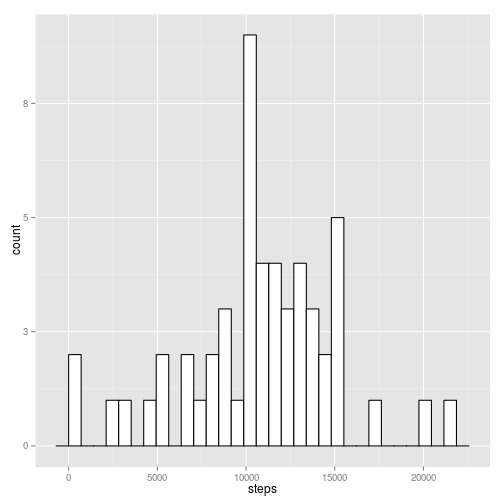
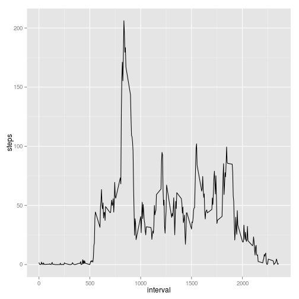
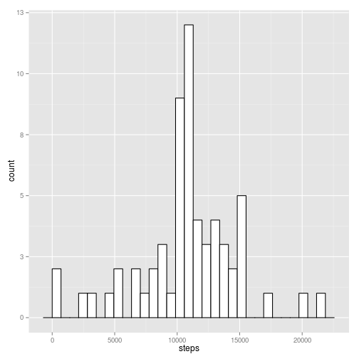
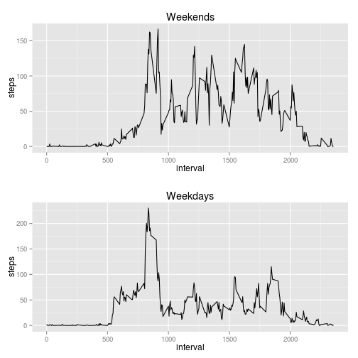

## Loading and preprocessing the data


```r
library(data.table)
```

```
## data.table 1.9.4  For help type: ?data.table
## *** NB: by=.EACHI is now explicit. See README to restore previous behaviour.
```

```r
library(ggplot2)
```

```
## Use suppressPackageStartupMessages to eliminate package startup messages.
```

```r
library(grid)
```

Unzip and read data.

```r
unzip('activity.zip')
data <- read.csv(file = "activity.csv")
```

## What is mean total number of steps taken per day?

Calculating total number of steps per day.

```r
activityDataPerDay <- data.table(data) [, 1:2, with = FALSE]
stepsPerDay <- aggregate(. ~ date, data=activityDataPerDay, FUN=sum)
```

Plotting totals per day.

```r
plot <- ggplot(stepsPerDay, aes(x=steps)) + geom_histogram(colour="black", fill="white") + scale_y_continuous(labels = function (x) ceiling(x))
print(plot)
```

```
## stat_bin: binwidth defaulted to range/30. Use 'binwidth = x' to adjust this.
```

 

Calculating mean and median.

```r
meanPerDay <- mean(stepsPerDay$steps)
medianPerDay <- median(stepsPerDay$steps)
```

Mean and median of total number of steps taken per day are 10766.19 and 10765 respectively. 

## What is the average daily activity pattern?

Time series plot of the 5-minute interval and average number of steps taken averaged across all days.


```r
activityDataPerInterval <- data.table(data) [, c(1,3), with = FALSE]
stepsPerInterval <- aggregate(. ~ interval, data=activityDataPerInterval, FUN=mean)
plot <- ggplot(stepsPerInterval, aes(x=interval, y=steps)) + geom_line()
print(plot)
```

 

```r
intervalWithMaxAverageSteps <- stepsPerInterval[stepsPerInterval$steps == max(stepsPerInterval$steps),]
```

Interval with maximum number of average steps is 835.

## Imputing missing values


```r
rowsWithMissingSteps <- nrow(data[is.na(data$steps),])
```

Total number of rows is with NA as steps is 2304. Dates and intervals always have values. 

Strategy for replacing NAs in data sets is to use average steps of the interval.


```r
replacementStragegy <- function(interval) {
  stepsPerInterval[stepsPerInterval$interval == interval, c('steps')]
}
```

Creating a new dataset where NAs are replaced by average steps per interval.


```r
dataWithNasFilledIn <- data
dataWithNasFilledIn[is.na(dataWithNasFilledIn$steps), c('steps')] <- replacementStragegy(stepsPerInterval$interval)
```

Histogram of total number of steps taken per day with NAs replaced with averages.


```r
activityDataPerDayWithImputedValues <- data.table(dataWithNasFilledIn) [, 1:2, with = FALSE]
stepsPerDayWithImputedValues <- aggregate(. ~ date, data=activityDataPerDayWithImputedValues, FUN=sum)
plot <- ggplot(stepsPerDayWithImputedValues, aes(x=steps)) + geom_histogram(colour="black", fill="white") + scale_y_continuous(labels = function (x) ceiling(x))
print(plot)
```

```
## stat_bin: binwidth defaulted to range/30. Use 'binwidth = x' to adjust this.
```

 

Calculating mean and median.


```r
meanPerDayWithImputedValues <- mean(stepsPerDayWithImputedValues$steps)
medianPerDayWithImputedValues <- median(stepsPerDayWithImputedValues$steps)
```

Mean and median of total number of steps taken per day are 10766.19 and 10766.19 respectively. 

## Are there differences in activity patterns between weekdays and weekends?

Dividing dataset to weekend and weekday specific parts (weekdays as in Finnish locale).


```r
dataWithDayInfo <- dataWithNasFilledIn
dataWithDayInfo[, 'day'] <- weekdays(as.Date(dataWithDayInfo$date))
dataWithDayInfo[dataWithDayInfo$day == 'lauantai' | dataWithDayInfo$day == 'sunnuntai', c('day')] <- "weekend"
dataWithDayInfo[dataWithDayInfo$day != 'weekend', c('day')] <- "weekday"
dataWithDayInfo$day <- as.factor(dataWithDayInfo$day)

weekendData <- dataWithDayInfo[dataWithDayInfo$day == 'weekend',]
weekdayData <- dataWithDayInfo[dataWithDayInfo$day == 'weekday',]
```

Calculating averages for weekends and weekdays.


```r
weekendStepsPerInterval <- aggregate(. ~ interval, data=weekendData, FUN=mean)
weekdayStepsPerInterval <- aggregate(. ~ interval, data=weekdayData, FUN=mean)
```

Weekend and weekdays averages in a panel plot.

```r
weekendPlot <- ggplot(weekendStepsPerInterval, aes(y=steps, x=interval)) + geom_line() + ggtitle("Weekends")
weekdayPlot <- ggplot(weekdayStepsPerInterval, aes(y=steps, x=interval)) + geom_line() + ggtitle("Weekdays")
layout <- matrix(seq(1, 2), ncol = 1, nrow = 2)
grid.newpage()
pushViewport(viewport(layout = grid.layout(nrow(layout), ncol(layout))))
print(weekendPlot, vp = viewport(layout.pos.row = 1, layout.pos.col = 1))
print(weekdayPlot, vp = viewport(layout.pos.row = 2, layout.pos.col = 1))
```

 
